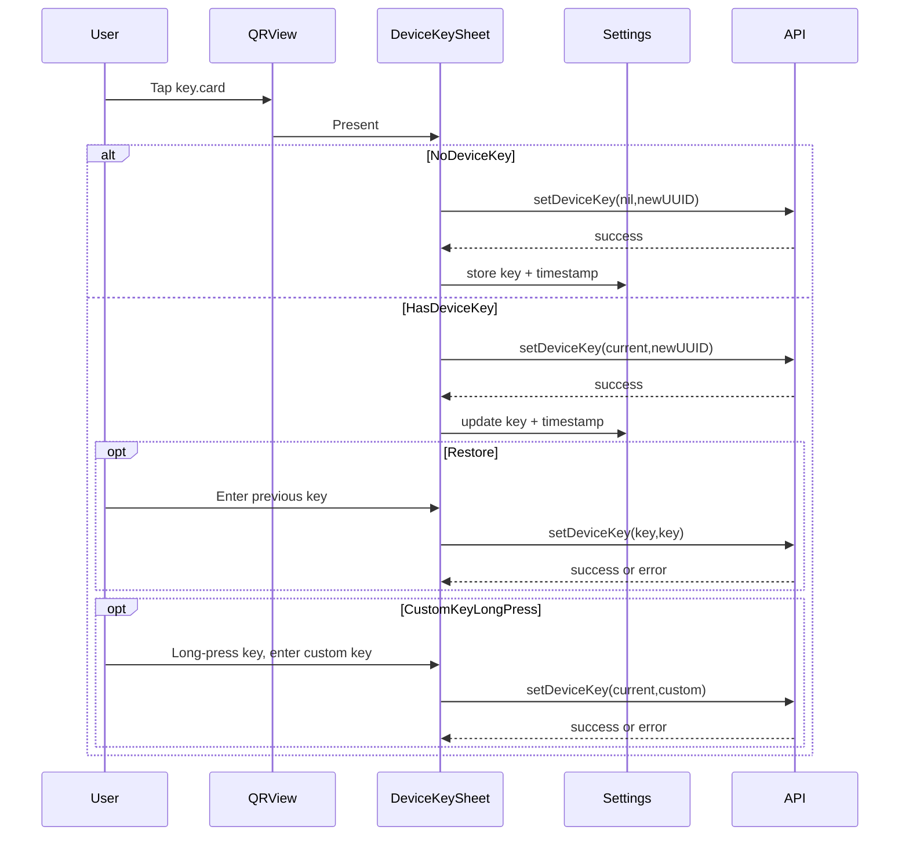

# DeviceKey Authentication Plan

## Scope And Entry Points

- Persist current DeviceKey and last-change timestamp in `SettingsManager` (UserDefaults) as requested, alongside existing settings keys and initialization logic in `[/Users/bietiekay/code/miataru-ios-app/miataru/miataru/SettingsManagers/App Settings/SettingsManager.swift](/Users/bietiekay/code/miataru-ios-app/miataru/miataru/SettingsManagers/App%20Settings/SettingsManager.swift)`.
- Add a DeviceKey management sheet launched from the QR view in `[/Users/bietiekay/code/miataru-ios-app/miataru/miataru/views/iPhone/iPhone_MyDeviceQRCodeView.swift](/Users/bietiekay/code/miataru-ios-app/miataru/miataru/views/iPhone/iPhone_MyDeviceQRCodeView.swift)`.
- Thread the DeviceKey into protected API calls via the existing client support in `[/Users/bietiekay/code/miataru-ios-app/miataru/Libraries/MiataruClientSwift/Sources/MiataruAPIClient/MiataruAPIClient.swift](/Users/bietiekay/code/miataru-ios-app/miataru/Libraries/MiataruClientSwift/Sources/MiataruAPIClient/MiataruAPIClient.swift)`.

## Data Model And Persistence

- Extend `SettingsManager` with:
  - `@Published var deviceKey: String?` stored under a new key, and remove the value when nil.
  - `@Published var deviceKeyLastChanged: Date?` stored under a new key.
  - Initialize from defaults in `init()` similarly to existing settings.
- Add a small helper to format the timestamp for UI display (likely in the new sheet view model or via `DateFormatter` per view).

Relevant patterns for settings persistence:

```114:139:/Users/bietiekay/code/miataru-ios-app/miataru/miataru/SettingsManagers/App Settings/SettingsManager.swift
    private enum Keys {
        static let mapType = "map_type"
        static let disableDeviceAutolock = "disable_device_autolock_while_in_foreground"
        // ... existing keys ...
    }
```

## DeviceKey Management UI (New Sheet)

- Add a new toolbar button in the Device ID section of `iPhone_MyDeviceQRCodeView` with the `key.card` system image that toggles a sheet presentation.
- Create a new SwiftUI sheet view (new file under `views/iPhone/` or `views/Common/`) that supports two states:
  - **State A (no key set):**
    - Explanation text (English) describing the purpose and irreversibility (cannot remove, only change), and risk if lost.
    - “Generate and set DeviceKey” button that:
      - Generates a UUID string.
      - Calls `MiataruAPIClient.setDeviceKey` with `currentDeviceKey: nil`.
      - On success: persist key + timestamp in `SettingsManager` and transition to State B.
      - On failure: show server error message and keep State A.
  - **State B (key set):**
    - Text field (read-only style) that shows the key and a copy icon, following the existing clipboard pattern in `iPhone_MyDeviceQRCodeView`.
    - Long-press gesture on the displayed key that opens a custom key entry form:
      - Allows the user to enter a custom DeviceKey (up to 256 Unicode chars).
      - Calls `setDeviceKey` with current + user-provided key on submit.
      - On success: persist key + timestamp; on error: show server message and keep form open with entered value.
    - Date/time display (formatted from `deviceKeyLastChanged`).
    - “Regenerate/Reset” button:
      - Generates UUID, calls `setDeviceKey` with current + new key, and updates persistence on success.
    - “Restore” button:
      - Opens an input dialog (custom sheet or alert-style with text entry).
      - Calls `setDeviceKey` with user-provided key for both `currentDeviceKey` and `newDeviceKey` to validate.
      - On error: show server message and reopen with previous text.
- Keep all user-facing strings in English and add new localization keys in the app’s `.strings` files if that is the current pattern for UI text.

Sheet presentation pattern reference:

```116:133:/Users/bietiekay/code/miataru-ios-app/miataru/miataru/views/iPhone/iPhone_MyDeviceQRCodeView.swift
                .sheet(isPresented: $showMailComposer, onDismiss: { qrImage = nil }) {
                    MailView(
                        deviceID: thisDeviceIDManager.shared.deviceID,
                        qrImage: qrImage ?? (generateQRCodeImage() ?? UIImage())
                    )
                }
```

## Authenticated Requests (Protected Operations)

- Pass `SettingsManager.shared.deviceKey` into protected API calls when available:
  - `LocationManager.sendLocationToServer`: include in `UpdateLocationPayload`.
  - `DeviceLocationRefresher.refreshVisitorHistory`: pass `deviceKey` in `getVisitorHistory`.
  - `VisitorHistoryViewModel.loadVisitorHistory`: pass `deviceKey` in `getVisitorHistoryWithConfig`.
  - Any `deleteLocation` or `setAllowedDeviceList` usage in the app should be updated similarly when those call sites are located.

Payload support already exists in the client:

```212:261:/Users/bietiekay/code/miataru-ios-app/miataru/Libraries/MiataruClientSwift/Sources/MiataruAPIClient/MiataruAPIClient.swift
public struct UpdateLocationPayload: Codable {
    public let Device: String
    public let DeviceKey: String?
    // ...
    public func encode(to encoder: Encoder) throws {
        // ...
        if let DeviceKey = DeviceKey, !DeviceKey.isEmpty {
            try container.encode(DeviceKey, forKey: .DeviceKey)
        }
    }
}
```

## Centralized Error Handling And UX (Force DeviceKey Sheet)

- Add a shared error handler (likely a small helper in a new `DeviceKeyAuthHandler` file) that:
  - Detects `MiataruAPIClient.APIError.serverError` with relevant messages/status codes.
  - Emits a notification or binding to present the DeviceKey sheet.
- For the specific protected calls, wrap errors and, on auth failure:
  - Show a short error message (alert/banner) explaining the key is missing/invalid.
  - Automatically present the DeviceKey sheet (per your preference).
  - Do not auto-retry; user retries manually after updating the key.

## UI And Flow Diagram




## Tests And Validation

- Add unit tests (if test targets are used for view models) for:
  - `SettingsManager` DeviceKey persistence behavior.
  - Validation flow for restore (success and server error) if the logic is abstracted into a view model.
- Manual test checklist:
  - Fresh install: “Generate and set DeviceKey” succeeds and persists.
  - App relaunch: key + timestamp restored from UserDefaults.
  - Update location succeeds with key; invalid key yields error and forces sheet.
  - Visitor history requests pass key and behave correctly on auth failure.
  - Regenerate and restore flows update storage and UI states.

## Files Likely Touched

- `[/Users/bietiekay/code/miataru-ios-app/miataru/miataru/SettingsManagers/App Settings/SettingsManager.swift](/Users/bietiekay/code/miataru-ios-app/miataru/miataru/SettingsManagers/App%20Settings/SettingsManager.swift)`
- `[/Users/bietiekay/code/miataru-ios-app/miataru/miataru/views/iPhone/iPhone_MyDeviceQRCodeView.swift](/Users/bietiekay/code/miataru-ios-app/miataru/miataru/views/iPhone/iPhone_MyDeviceQRCodeView.swift)`
- New view file for DeviceKey sheet (e.g., `miataru/miataru/views/iPhone/iPhone_DeviceKeySheetView.swift`)
- `[/Users/bietiekay/code/miataru-ios-app/miataru/miataru/LocationManagers/LocationManager.swift](/Users/bietiekay/code/miataru-ios-app/miataru/miataru/LocationManagers/LocationManager.swift)`
- `[/Users/bietiekay/code/miataru-ios-app/miataru/miataru/LocationManagers/DeviceLocationRefresher.swift](/Users/bietiekay/code/miataru-ios-app/miataru/miataru/LocationManagers/DeviceLocationRefresher.swift)`
- `[/Users/bietiekay/code/miataru-ios-app/miataru/miataru/views/iPhone/iPhone_VisitorHistoryView.swift](/Users/bietiekay/code/miataru-ios-app/miataru/miataru/views/iPhone/iPhone_VisitorHistoryView.swift)`
- String resources under `miataru/miataru/Localizable.xcstrings` or the project’s existing localization files for new UI copy.

