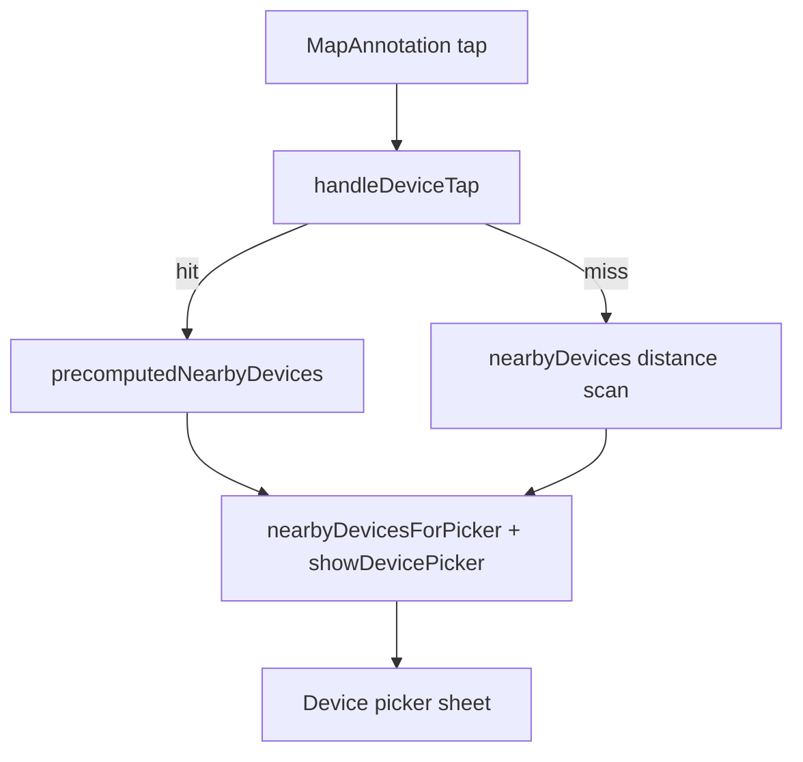

# Device Tap Nearby Sheet Analysis

## What I'll review

- `iPhone_DeviceMapView.swift` and `iPad_DeviceMapView.swift` selection flow (`handleDeviceTap`, `nearbyDevices`, `computeNearbyGroups`, `refreshCachedDeviceCoordinates`).
- Caches/stores that feed map annotations: `DeviceLocationCacheStore`, `KnownDeviceStore`, and any map-annotation rendering hooks.

## Current flow (from code)

- Tap on annotation → `handleDeviceTap(deviceID, coordinate)` → looks up `precomputedNearbyDevices[deviceID] `else calls `nearbyDevices(...)` to build a list, then sets `nearbyDevicesForPicker` and flips `showDevicePicker`.
- `refreshCachedDeviceCoordinates()` builds `cachedDeviceCoordinates` and `precomputedNearbyDevices` on each map camera change using `computeNearbyGroups` (O(n²) distance checks on main).
- Map annotations render from `DeviceLocationCacheStore` and `deviceStore.devices`; locations are already cached before drawing markers.

## Suspected causes for slow/empty list

- O(n²) `computeNearbyGroups` on every camera change competes on the main thread; tap may arrive before it finishes or while it is recomputing, so sheet opens before data is ready.
- `nearbyDevices` recomputes distances on demand with fresh `CLLocation` objects for every device; with many devices this runs on the main thread and can block initial rendering.
- No precomputed `CLLocation` cache; repeated conversions and sorts per tap/camera change.
- Work is tied to camera changes instead of location-cache changes; recalculation may lag behind the rendered annotations.

## Proposed improvements

- **Precompute once**: Build a lightweight spatial index (grid/kd-tree) of cached coordinates keyed by `DeviceID` when `DeviceLocationCacheStore.locations` changes, not on every camera change. Store nearest-neighbor groups in a dedicated manager.
- **Constant-time tap lookup**: On tap, read the prebuilt groups; if missing, fall back to a fast grid lookup (no async, no network). Avoid per-tap distance scans over all devices.
- **Main-thread reduction**: Move neighbor computation to a background queue and publish results to the view model; keep tap handling on main with already-ready data.
- **UI polish**: Present sheet only after group is available (or show a tiny inline loading indicator if recompute is forced), and ensure `nearbyDevicesForPicker` is set before toggling the sheet.