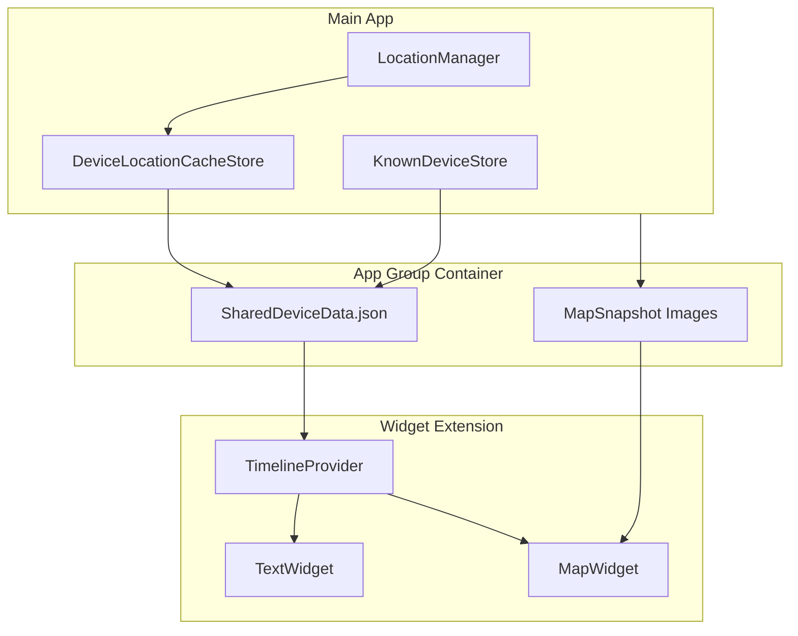

# Miataru iOS Widgets Implementation

## Architecture Overview




## Key Implementation Details

### 1. App Group Setup

- Create App Group: `group.com.miataru.ios`
- Enable App Groups capability for main app target
- Enable App Groups capability for widget extension target

### 2. Shared Data Layer

Create a new shared data model that both the main app and widget can access:**File**: `miataru/SettingsManagers/SharedWidgetData.swift`

- `WidgetDeviceData` struct (Codable) containing: deviceID, deviceName, latitude, longitude, locality, country, timestamp, color
- `SharedWidgetDataManager` to read/write JSON to App Group container
- Include "this device" location for distance calculations

### 3. Widget Extension Target

Create new target: `miataruWidgets`**Files to create**:

- `miataruWidgets/MiataruWidgets.swift` - Widget bundle entry point
- `miataruWidgets/DeviceLocationTextWidget.swift` - Text-based widget
- `miataruWidgets/DeviceLocationMapWidget.swift` - Map snapshot widget
- `miataruWidgets/WidgetIntents.swift` - Device selection intent for widget configuration
- `miataruWidgets/Assets.xcassets` - Widget preview assets

### 4. Text Widget (DeviceLocationTextWidget)

Shows: "Device XYZ is in Locality, Country - X km away"**Tap action**: `widgetURL` deep link to `miataru://<deviceID>` to open that device in the app.**Supported sizes**:

- `.systemSmall` - Device name + location + distance
- `.systemMedium` - Device name + full location + distance + last update time
- `.accessoryRectangular` (Lock Screen) - Compact location + distance

### 5. Map Widget (DeviceLocationMapWidget)

Shows pre-rendered map snapshot with device marker overlay**Approach**:

- Main app generates `MKMapSnapshotter` images when location updates
- Saves PNG to App Group container
- Widget displays cached image with text overlay

**Tap action**: `widgetURL` deep link to `miataru://<deviceID>` to open that device in the app.**Supported sizes**:

- `.systemSmall` - Map only with marker
- `.systemMedium` - Map with location text overlay
- `.systemLarge` - Map with device name, location, and timestamp

### 6. Main App Integration

Modify existing stores to sync data to App Group:**Update** [`DeviceLocationCacheStore.swift`](DeviceLocationCacheStore.swift)(miataru/SettingsManagers/App Settings/Devices/DeviceLocationCacheStore.swift):

- Call `SharedWidgetDataManager.syncDeviceLocations()` on location updates
- Trigger `WidgetCenter.shared.reloadAllTimelines()` after sync

**Update** [`KnownDeviceStore.swift`](KnownDeviceStore.swift)(miataru/SettingsManagers/App Settings/Devices/KnownDeviceStore.swift):

- Sync device names/colors to shared storage on changes

**Add map snapshot generation**:

- Create `WidgetMapSnapshotGenerator.swift` in main app
- Generate snapshots using `MKMapSnapshotter` 
- Draw `MiataruMapMarker` onto snapshot
- Save to App Group container

### 7. Distance Calculation

- Widget reads "this device" location from shared data
- Calculates distance to selected tracked device using `CLLocation.distance(from:)`
- Formats distance in km/miles based on locale

### 8. Deep Link Handling

- Use `widgetURL` / `Link` to set `miataru://<deviceID>` for all widgets
- Ensure main app openURL routing brings the user directly to the selected device detail/map

## Widget Configuration

Users select which device to display via widget configuration intent:

- Dynamic options populated from `KnownDeviceStore` devices
- Excludes "this device" from selection (only shows other tracked devices)

## File Structure

```javascript
miataru/
├── SettingsManagers/
│   └── SharedWidgetData.swift (NEW)
├── views/
│   └── Common/
│       └── WidgetMapSnapshotGenerator.swift (NEW)
miataruWidgets/ (NEW TARGET)
├── MiataruWidgets.swift
├── DeviceLocationTextWidget.swift
├── DeviceLocationMapWidget.swift
├── WidgetIntents.swift
├── Info.plist
└── Assets.xcassets/
```


## Xcode Project Changes

- Add Widget Extension target via Xcode