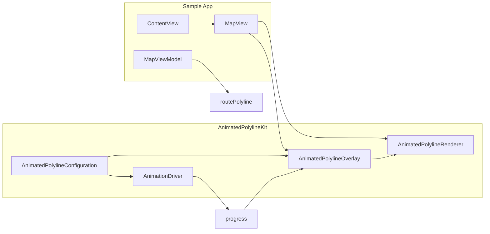

# Animated Polyline with Moving Gradient

## Context

- **Package**: [Sources/AnimatedPolylineKit/AnimatedPolylineKit.swift](Sources/AnimatedPolylineKit/AnimatedPolylineKit.swift) is currently a stub.
- **Consumer**: [Sample/AnimatedMapPolyline/ContentView.swift](Sample/AnimatedMapPolyline/ContentView.swift) uses a custom `MapView` (UIViewRepresentable wrapping `MKMapView`), draws a static blue `MKPolyline` from `viewModel.routePolyline`, and shows start/end markers. The route comes from `MKDirections`.

The goal is to add a SwiftUI-usable component that renders the same route with **one color gradient moving from the start marker toward the end marker**, with configurable gradient, direction, colors, speed, and easing.

## Architecture

- **Configuration** drives both the overlay’s appearance and the animation (direction, speed, easing).
- **Overlay** holds route coordinates (copy from `MKPolyline`), config, and current **progress** (0...1). Progress is updated by the app (or a driver) and triggers redraw.
- **Renderer** (MapKit overlay renderer) draws the polyline with a moving gradient based on overlay’s progress and config.
- **Sample** creates the overlay from the route, adds it to the map, and runs the animation (e.g. repeating timer or SwiftUI animation), updating progress and invalidating the renderer.

## 1. Package setup

- In [Package.swift](Package.swift): add platform requirement (e.g. `.platform(.iOS(.v15))` or `.iOS(.v15)`) so MapKit/SwiftUI are available; no extra dependencies needed.
- Keep the public API in [Sources/AnimatedPolylineKit/AnimatedPolylineKit.swift](Sources/AnimatedPolylineKit/AnimatedPolylineKit.swift) as re-exports or a single file, or split into multiple files under `Sources/AnimatedPolylineKit/` (e.g. `Configuration.swift`, `AnimatedPolylineOverlay.swift`, `AnimatedPolylineRenderer.swift`, `AnimationDriver.swift`) and expose types from the main module.

## 2. Configuration model (SwiftUI-friendly)

Introduce `**AnimatedPolylineConfiguration**` (and related types) so the gradient, direction, and animation are configurable:

- **Gradient / colors**: e.g. `startColor`, `endColor` (SwiftUI `Color` or `UIColor`), or a small array of colors for a multi-stop gradient. Optional “track” color for the part of the line not yet covered by the moving gradient.
- **Direction**: enum (e.g. `startToEnd` / `endToStart`) to control whether the gradient moves from first coordinate to last or the reverse.
- **Speed**: animation duration in seconds (or speed as “length per second”); one is enough, duration is simpler.
- **Easing**: start and end easing (e.g. `linear`, `easeIn`, `easeOut`, `easeInOut`). Apply to the **time → progress** mapping so the gradient motion respects easing at start and end.
- **Line appearance**: line width, line cap, line join (optional; sensible defaults).

All comments and string literals in English.

## 3. Custom overlay and renderer (MapKit)

- `**AnimatedPolylineOverlay**`: `NSObject` conforming to `MKOverlay`. Holds:
  - Copy of route coordinates (from the sample’s `MKPolyline`).
  - `AnimatedPolylineConfiguration`.
  - `progress: Double` (0...1), writable from outside (e.g. from the sample or a driver).
  - Optional weak reference to the renderer used to draw this overlay; when `progress` is set, call `renderer?.setNeedsDisplay()` so the map redraws without replacing the overlay.
  - Implement `coordinate` and `boundingMapRect` from the route points.
- `**AnimatedPolylineRenderer**`: `MKOverlayRenderer` (or subclass of `MKPolylineRenderer` if you keep a single polyline and only change drawing). Responsibilities:
  - In `draw(_:zoomScale:in:)`, build the polyline path in screen space from the overlay’s coordinates.
  - Interpret **progress** and **direction**: compute the segment along the path that represents the “moving gradient” (e.g. from 0 to `progress` in path length for start→end).
  - Draw the “track” segment (rest of the line) in the track color.
  - Draw the “gradient” segment with a gradient from `startColor` to `endColor` along that segment. Implementation option: approximate by drawing short segments with interpolated colors along the path (works for any path shape).
  - Use configuration for line width, cap, join.

No need to subclass `MKPolyline`; a dedicated overlay type keeps the design clear and avoids relying on subclassing MapKit’s polyline.

## 4. Animation driver (optional but useful)

Provide a simple **animation driver** that the sample (or any SwiftUI view) can use to advance progress:

- **Option A**: A type that takes configuration (duration, easing) and exposes a `progress` value (e.g. `@Published` or `Binding`) that goes from 0 to 1 (and optionally loops or reverses). The driver can use a repeating animation or `Timer`/`CADisplayLink` and apply the configured easing to the raw t value.
- **Option B**: A minimal helper (e.g. a function or small struct) that, given `t` in [0,1], returns eased progress; the sample owns the timer and calls this to set `overlay.progress`.

In both cases, **easing** is applied to the **time → progress** curve (e.g. ease-in at start of animation, ease-out at end), so the gradient motion slows at the ends if configured.

## 5. SwiftUI surface

- Expose a **SwiftUI-usable** API:
  - The sample already has a `MapView`; it should be able to pass an `**AnimatedPolylineOverlay**` (and its configuration) instead of a raw `MKPolyline`, and the map should add this overlay and use `**AnimatedPolylineRenderer**` in `rendererFor overlay`.
  - Optionally provide a small **SwiftUI view or modifier** that:
    - Takes the overlay and configuration,
    - Runs the animation (using the driver above) and updates `overlay.progress`,
    - So the consumer only wires the overlay into their `MapView` and attaches this view/modifier (e.g. in the same view hierarchy) to run the animation. No need to replace the whole map with a single monolithic view unless you prefer that design.

So the “SwiftUI view/component” can be either:

- The **overlay + renderer + configuration** used inside the existing MapView, plus an optional **animation view/modifier**, or
- A single **AnimatedPolylineMapView** that embeds the map, overlay, renderer, and animation. Given the sample already has a custom MapView and markers, the first option is more flexible and matches “utilized by AnimatedMapPolylineApp to render the animated polyline”.

## 6. Sample app integration

- In [Sample/AnimatedMapPolyline/ContentView.swift](Sample/AnimatedMapPolyline/ContentView.swift) (or `MapViewModel`):
  - When a route is available (`routePolyline`), create an `**AnimatedPolylineOverlay**` from it (copy coordinates from `MKPolyline` into the overlay) with an `**AnimatedPolylineConfiguration**` (e.g. gradient colors, duration, direction, easing).
  - Pass this overlay (and optionally config) to `**MapView**` instead of or in addition to the raw polyline; ensure `**MapView**` adds only the animated overlay (so the route is drawn once, with animation).
- In `**MapView**` / Coordinator:
  - In `rendererFor overlay`: if `overlay is AnimatedPolylineOverlay`, return an `**AnimatedPolylineRenderer**` initialized with this overlay; store a reference to the overlay (and optionally the renderer) in the coordinator so that when progress is updated from SwiftUI, the overlay can trigger `setNeedsDisplay()` on the renderer.
  - Drive the animation: either from the view model (e.g. `Timer` or `withAnimation`) or from the optional animation view/modifier from the kit, updating `overlay.progress` and ensuring the renderer is invalidated (via the overlay’s weak ref to the renderer).

Result: the route is drawn as an animated polyline with a gradient moving from the start marker toward the end marker, with configurable colors, direction, speed, and start/end easing.

## 7. File layout (suggested)

- **Sources/AnimatedPolylineKit/**
  - `AnimatedPolylineKit.swift` – public API / re-exports if you split.
  - `AnimatedPolylineConfiguration.swift` – configuration and easing.
  - `AnimatedPolylineOverlay.swift` – overlay class.
  - `AnimatedPolylineRenderer.swift` – renderer class.
  - `AnimationDriver.swift` (optional) – progress driver for SwiftUI.

Keep the number of files small if you prefer; a single-file implementation in `AnimatedPolylineKit.swift` is also acceptable for a first version.

## 8. Edge cases

- **Empty or single-point route**: overlay should handle 0 or 1 point without crashing (no draw or a single point).
- **Progress updates off main thread**: ensure `progress` is set on the main thread and that `setNeedsDisplay()` is called on the main thread so MapKit doesn’t complain.
- **Route changes**: when the user generates a new route, the sample creates a new overlay and replaces the old one in the map; reset animation progress (e.g. to 0) for the new overlay.

---

## Summary

| Deliverable                                                  | Location                     | Purpose                                      |
| ------------------------------------------------------------ | ---------------------------- | -------------------------------------------- |
| Configuration (colors, direction, speed, easing, line style) | AnimatedPolylineKit          | Configurable gradient and animation          |
| Custom MKOverlay + progress                                  | AnimatedPolylineKit          | Hold route, config, progress; trigger redraw |
| Custom MKOverlayRenderer                                     | AnimatedPolylineKit          | Draw moving gradient along path              |
| Optional animation driver                                    | AnimatedPolylineKit          | Eased 0→1 progress for SwiftUI               |
| MapView + overlay integration                                | Sample ContentView / MapView | Use overlay and renderer; run animation      |

No changes to [AnimatedMapPolylineApp.swift](Sample/AnimatedMapPolyline/AnimatedMapPolylineApp.swift) are required beyond possibly passing the overlay/config from `ContentView`; the app entry point can stay as-is.