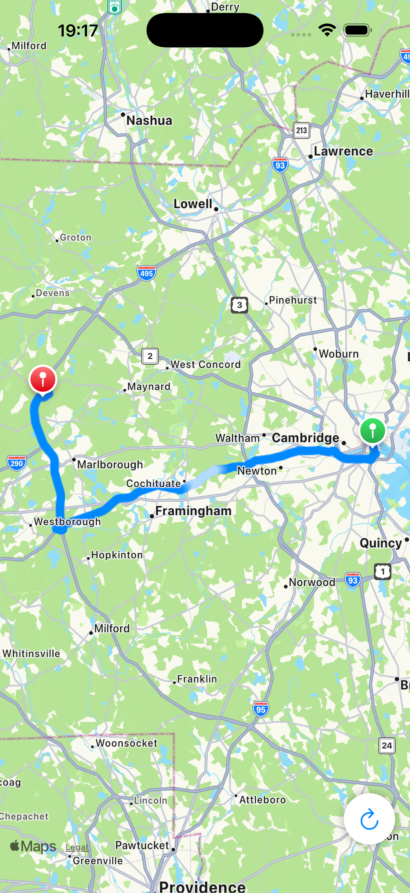

# AnimatedPolylineKit

A Swift package that renders an **animated polyline overlay** on `MKMapView`: a full route line with a moving highlight (gradient patch) along the path. Ideal for navigation apps, delivery tracking, or any app that needs to show “progress” or direction along a route.

## Demo



Video: [Screenshots/demo.mp4](Screenshots/demo.mp4)

<video src="Screenshots/demo.mp4" controls width="640"></video>

*The demo app shows a route between two random locations with a continuously animated highlight moving along the path. Use the refresh button to generate a new route.*

---

## What the Kit Does

- **Renders a full route** in a color you choose (the “underlying” polyline).
- **Animates a short highlight segment** along that route: a brighter band (blend toward white) that moves from start-to-end or end-to-start.
- **Fully configurable from your app**: colors, patch length, highlight strength, animation duration, easing, line width, cap, and join. The package does not hardcode any of these; you supply a complete `AnimatedPolylineConfiguration`.

The kit provides:

- `AnimatedPolylineConfiguration` – all visual and animation settings (colors, gradients, speed, easing, line style).
- `AnimatedPolylineOverlay` – the MapKit overlay that holds coordinates and configuration.
- `AnimatedPolylineRenderer` – draws the polyline and the moving patch on the map.
- `AnimatedPolylineAnimationDriver` – drives progress from 0 to 1 with optional looping (uses your config for duration and easing).

---

## Kit components (how they work)

### AnimatedPolylineConfiguration

A **value type** that holds every visual and animation setting. The package does not define defaults; your app supplies a full configuration. It includes:

- **Colors & patch:** `underlyingColor` (full route), `patchLength`, `patchWhiteBandFraction`, `patchHighlightBlend` (how much the moving band blends toward white).
- **Animation timing:** `duration` (one cycle in seconds), `startEasing`, `endEasing`, `direction` (startToEnd or endToStart).
- **Stroke:** `lineWidth`, `lineCap`, `lineJoin`.

The same configuration is used by both the **overlay** (for drawing) and the **animation driver** (for duration and easing). Supporting types: `AnimatedPolylineDirection`, `AnimatedPolylineEasing`, `AnimatedPolylineLineCap`, `AnimatedPolylineLineJoin`.

---

### AnimatedPolylineOverlay

A **MapKit overlay** (`MKOverlay`) that holds:

- **Coordinates** – the route path (from your `[CLLocationCoordinate2D]` or `MKPolyline`).
- **Configuration** – the `AnimatedPolylineConfiguration` used by the renderer.
- **Progress** – a value in `[0, 1]` that defines *where* along the path the moving patch is drawn. Your app (or the animation driver) sets `overlay.progress`; the renderer reads it each frame.

Progress is **thread-safe**: it can be set from any thread. When set off the main thread, the kit uses a small **registry** to ask the corresponding renderer to redraw on the main queue, without retaining the overlay (for Swift 6 sendability). The overlay also implements `coordinate` and `boundingMapRect` so MapKit can place and clip it correctly.

---

### AnimatedPolylineRenderer

A **MapKit overlay renderer** (`MKOverlayRenderer`) that draws the animated polyline whenever MapKit asks. It:

1. **Registers** with the overlay’s registry on init (and unregisters in deinit) so the overlay can trigger redraws when `progress` is updated from a background thread.
2. In **`draw(_:zoomScale:in:)`**:
   - Reads the overlay’s `configuration` and `progress`.
   - Converts route coordinates to screen points and builds **normalized path lengths** (0…1 along the route).
   - Computes the **patch interval** – a short segment centered at `progress` (or `1 - progress` for endToStart), with length from `patchLength`.
   - Draws the **full route** in `underlyingColor`.
   - Draws the **moving patch** over that segment: a gradient from route color → highlight (blend toward white) → route color, using `patchWhiteBandFraction` and `patchHighlightBlend`.

So the renderer never drives time; it only draws. The **driver** (or your own code) is what advances `progress` over time.

---

### AnimatedPolylineAnimationDriver

The driver **turns time into progress** and publishes it. It does not draw anything; it only produces a number in `[0, 1]` that you assign to `overlay.progress`.

**How it works:**

1. **Display-link timing** – When you call `start()`, it records `startTime = CACurrentMediaTime()` and attaches a `CADisplayLink` to the main run loop. The display link fires once per frame (~60 fps), so progress updates are synced to the display.

2. **Time → raw progress** – On each tick it computes `elapsed = link.timestamp - startTime` and `t = elapsed / duration`. So `t` goes from 0 to 1 over one cycle; the speed is determined entirely by your config’s `duration`.

3. **Looping** – When `t >= 1`: if `loop == true`, it keeps the fractional part and adjusts `startTime` so the next cycle continues smoothly (no jump). If `loop == false`, it sets `progress = 1`, stops the display link, and leaves the animation at the end.

4. **Easing** – Raw `t` is passed through your config’s easing: `easeStart = startEasing.apply(to: t)` and `easeEnd = endEasing.apply(to: t)`. The driver **blends** these over the cycle: `progress = easeStart * (1 - t) + easeEnd * t`, so the motion is more “start-like” at the beginning and “end-like” at the end (e.g. slower start and slower finish).

5. **Publishing** – It sets `progress = blended`, which updates the `@Published` property. Your app (e.g. a Combine subscriber) forwards that to `overlay.progress` on the main queue. The overlay invalidates the renderer, and on the next frame the renderer draws the patch at the new position.

**Summary:** The driver uses a display link and your config’s duration and easing to produce a smooth, looping (or one-shot) progress in [0, 1]. You bind that to `overlay.progress` so the renderer can move the highlight along the route.

---

### AnimatedPolylineEasingHelper

A small **static helper** that applies the same blended start/end easing to a raw time value `t` in [0, 1]. Use it when you drive progress yourself (e.g. with a `Timer` or SwiftUI animation) instead of using `AnimatedPolylineAnimationDriver`.

---

## What the Demo App Does

The **Sample/AnimatedMapPolyline** app:

- Picks two locations (from a fixed set or a random point within 50 km).
- Requests a driving route with `MKDirections`.
- Creates an `AnimatedPolylineOverlay` with a custom `AnimatedPolylineConfiguration` (blue line, 2.5 s cycle, easeIn/easeOut, etc.).
- Uses `AnimatedPolylineAnimationDriver` to drive the overlay’s progress and show the moving highlight.
- Displays start/end markers and a refresh button to generate a new random route.

You can run the sample app to see the behavior and then reuse the same integration pattern in your own SwiftUI app.

---

## Requirements

- **iOS 15+**
- **Swift 6.2** (or compatible toolchain)
- **MapKit**, **SwiftUI**, **Combine** (used by the sample; the kit itself uses MapKit and SwiftUI for `Color`)

---

## Installation

### Swift Package Manager

1. In Xcode: **File → Add Package Dependencies…**
2. Enter the repository URL (e.g. `https://github.com/bietiekay/AnimatedPolylineKit`).
3. Add the **AnimatedPolylineKit** library to your app target.

Or add to your `Package.swift`:

```swift
dependencies: [
    .package(url: "https://github.com/bietiekay/AnimatedPolylineKit", from: "1.0.0"),
],
targets: [
    .target(
        name: "YourApp",
        dependencies: ["AnimatedPolylineKit"]
    ),
]
```

---

## Integration into Your SwiftUI App

### 1. Add the dependency

Add **AnimatedPolylineKit** to your app target as above.

### 2. Define your configuration

Create an `AnimatedPolylineConfiguration` with all settings (colors, patch, animation, line style). The package has no defaults; your app defines everything.

```swift
import AnimatedPolylineKit
import SwiftUI

let config = AnimatedPolylineConfiguration(
    underlyingColor: .blue,
    patchLength: 0.1,
    patchWhiteBandFraction: 0.55,
    patchHighlightBlend: 0.7,
    direction: .startToEnd,
    duration: 2.5,
    startEasing: .easeIn,
    endEasing: .easeOut,
    lineWidth: 10.0,
    lineCap: .round,
    lineJoin: .round
)
```

### 3. Create the overlay and animation driver

When you have a route (e.g. from `MKDirections` or your own `[CLLocationCoordinate2D]`):

```swift
// From coordinates
let overlay = AnimatedPolylineOverlay(coordinates: routeCoordinates, configuration: config)

// Or from an existing MKPolyline (e.g. from MKDirections)
let overlay = AnimatedPolylineOverlay(polyline: route.polyline, configuration: config)

let driver = AnimatedPolylineAnimationDriver(configuration: config, loop: true)
```

### 4. Drive progress into the overlay

Bind the driver’s progress to the overlay (e.g. in your view model):

```swift
driver.$progress
    .receive(on: DispatchQueue.main)
    .sink { [weak overlay] value in
        overlay?.progress = value
    }
    .store(in: &cancellables)

driver.start()
```

### 5. Show the map and add the overlay

Use a `UIViewRepresentable` wrapping `MKMapView`, and add the overlay like any other `MKOverlay`:

```swift
// In updateUIView (or equivalent):
mapView.removeOverlays(mapView.overlays)
if let overlay = animatedOverlay {
    mapView.addOverlay(overlay)
}
```

### 6. Provide the custom renderer

In your `MKMapViewDelegate`:

```swift
func mapView(_ mapView: MKMapView, rendererFor overlay: MKOverlay) -> MKOverlayRenderer {
    if let animatedOverlay = overlay as? AnimatedPolylineOverlay {
        return AnimatedPolylineRenderer(overlay: animatedOverlay)
    }
    return MKOverlayRenderer(overlay: overlay)
}
```

That’s all: the overlay uses your configuration for drawing and the driver uses it for timing and easing. For a full example, see **Sample/AnimatedMapPolyline** (e.g. `ContentView.swift` and the `MapViewModel`).

---

## Configuration Reference

| Parameter | Description |
|-----------|-------------|
| `underlyingColor` | Color of the full route line (SwiftUI `Color`). |
| `patchLength` | Length of the moving patch as a fraction of path length (e.g. `0.1` = 10%). Clamped to 0.02…1. |
| `patchWhiteBandFraction` | Fraction of the patch that is the brightest band (e.g. `0.55`). Rest is gradient. Clamped to 0.2…0.9. |
| `patchHighlightBlend` | Blend toward white for the highlight (0 = route color only, 1 = full white). |
| `direction` | `.startToEnd` or `.endToStart` – direction the patch moves. |
| `duration` | Duration of one full animation cycle in seconds. |
| `startEasing` / `endEasing` | Easing curves: `.linear`, `.easeIn`, `.easeOut`, `.easeInOut`. |
| `lineWidth` | Line width in points. |
| `lineCap` / `lineJoin` | Stroke cap and join (e.g. `.round`). |

---

## Project structure

- **Sources/AnimatedPolylineKit/** – Swift package source (configuration, overlay, renderer, animation driver).
- **Sample/AnimatedMapPolyline/** – Demo iOS app (SwiftUI + MapKit, random routes, refresh button).
- **Screenshots/** – `demo.png` and `demo.mp4` for the README.

---

## License

See [LICENSE.md](LICENSE.md) in this repository.
